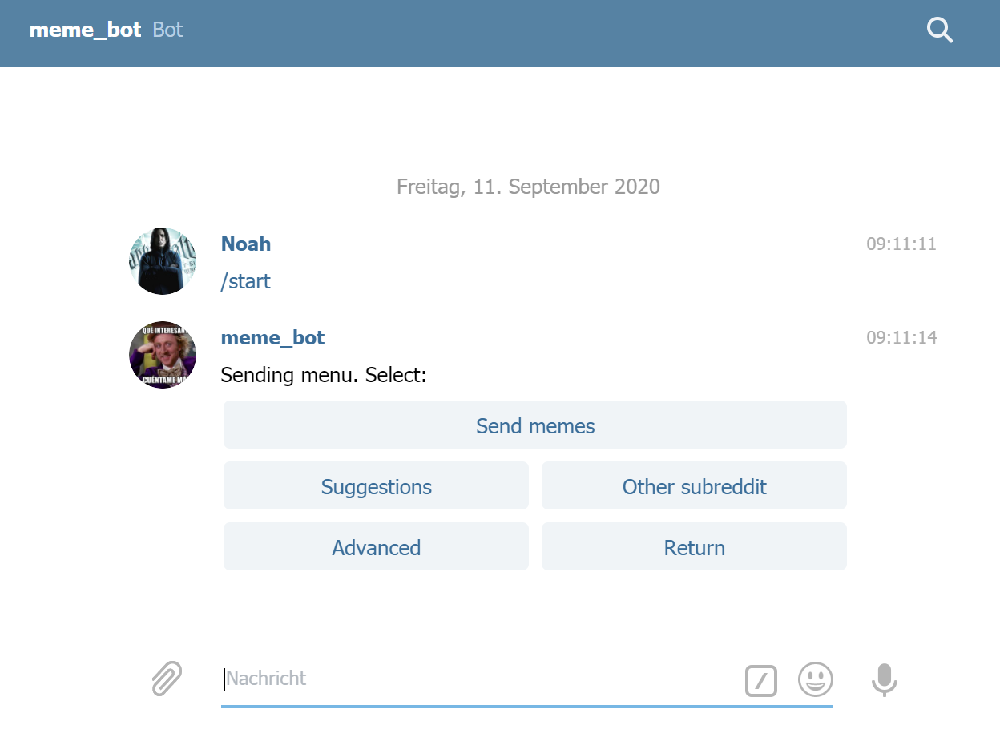
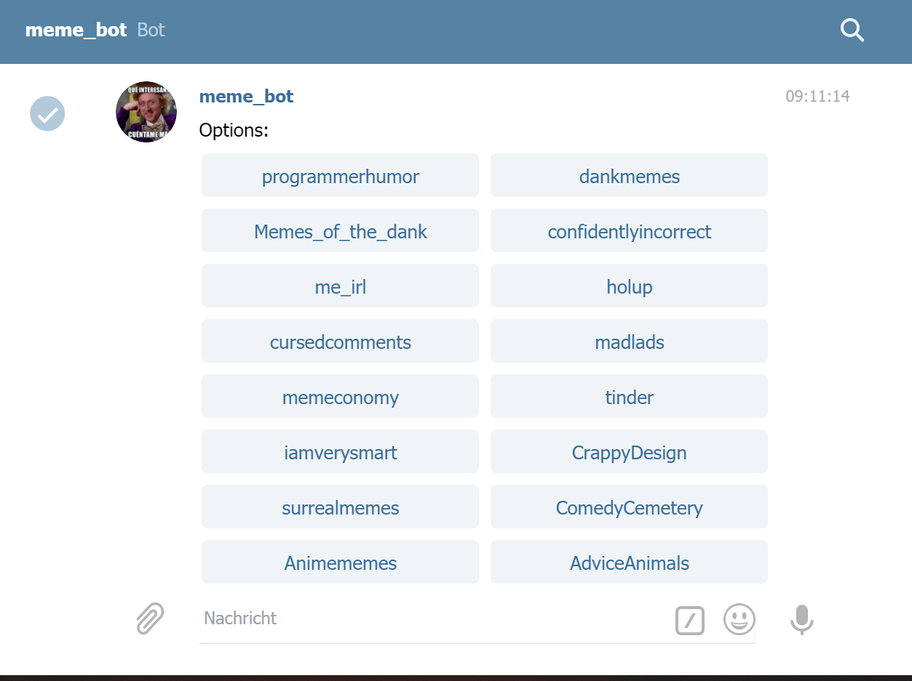
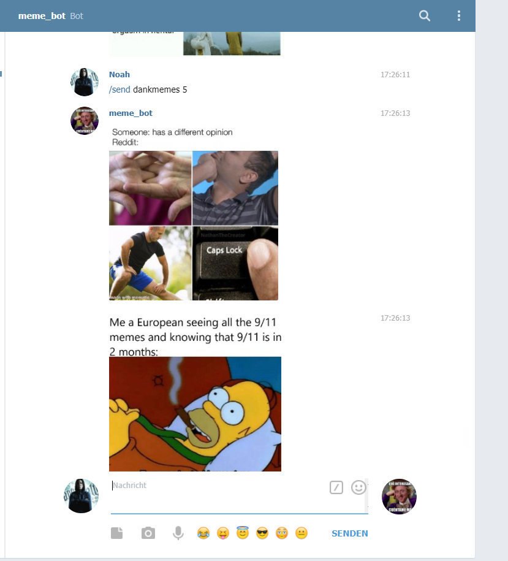

# Memebot
Telegram bot that downloads memes (or really any kind of images) from Reddit and sends them to users via Telegram at request.
There is a filter for how many upvotes a post needs to be considered by the bot, that filter can be altered in the config.ini file.

### Use /start to start a conversation with the bot.

### List of available suggestions, these can be changed in suggestions.txt (the number of buttons per row can be changed in the config.ini file)

### When asking for one of the suggested subs, a menu will pop up asking for how many images from  that subreddit should be sent.

### Finally, direct commands for custom subreddits, amounts of images, or minimum upvotes exist too.

<ins>Hosting this bot</ins> requires an installation of python3 and the libraries praw and python-telegram-bot to be run (can be installed via pip3).

Needs a bot token from telegram and account credentials from reddit to work, those go into telegram.ini and reddit.ini respectively.
